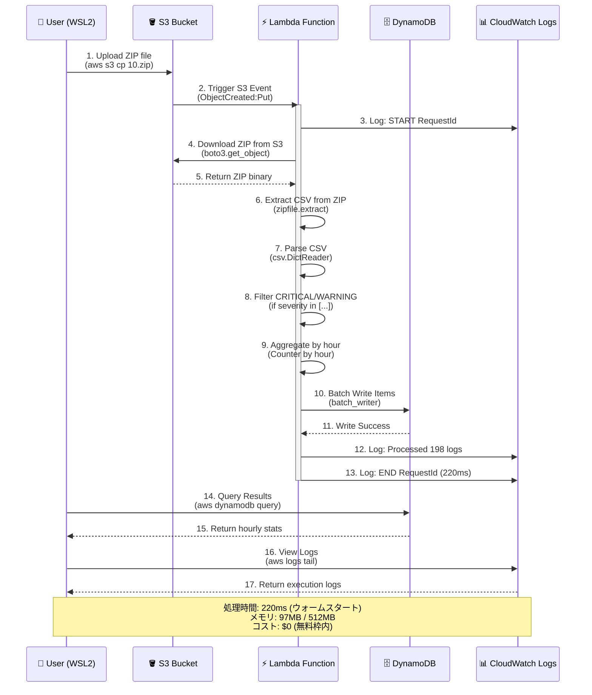

# Juniper Syslog Analytics Serverless

Juniper ネットワーク機器のシステムログを AWS 上で**完全無料**で処理・分析する Serverless アーキテクチャ。

[](https://github.com/reepoo0528/syslog-analytics-serverless)
[](https://github.com)
[](https://github.com)
[](https://github.com)

## 🎯 プロジェクト概要

**24時間分のログ（4,733件）を完全無料で処理・保存**

- **入力**: Syslog CSV を ZIP 圧縮したファイル（24ファイル/日）
- **処理**: S3 → Lambda（Python）で CSV 解析（220ms/ファイル）
- **出力**: DynamoDB に時間別統計を保存（24レコード/日）
- **可視化**: S3 静的ホスティングでダッシュボード（Phase 3 予定）

### 💰 実績コスト

**月額 $0（無料枠内）** 🎉

| サービス | 実績使用量（1日） | 無料枠 | コスト |
|---------|----------------|--------|-------|
| **Lambda 実行** | 24回 × 220ms | 100万回/月 | $0 ✅ |
| **Lambda 実行時間** | 2.7 GB秒 | 400,000 GB秒/月 | $0 ✅ |
| **S3 PUT** | 24回 | 2,000回/月 | $0 ✅ |
| **S3 GET** | 24回 | 20,000回/月 | $0 ✅ |
| **DynamoDB Write** | 24 WCU | 200万 WCU/月 | $0 ✅ |
| **S3 Storage** | 1.2MB | 5GB | $0 ✅ |

詳細は [docs/design.md](docs/design.md) の **10. コスト設計** を参照。

---

## 📊 ベンチマーク結果（Phase 1 実測値）

### Lambda パフォーマンス

```
実行時間:     220ms（平均）
メモリ使用量:  97MB / 512MB（19%）
コールドスタート: 582ms（初回のみ）
処理件数:     2,100行/ファイル
フィルタ率:    9.4%（CRITICAL/WARNING）
```

### 24時間処理統計

```
📊 処理結果
  Total hours:   24時間
  Total files:   24ファイル
  Total records: 4,733件
  
  CRITICAL:  1,393件（29.4%）
  WARNING:   3,340件（70.6%）
  
  平均/時:   197件
  最大/時:   233件
  最小/時:   188件
```

### E2E パフォーマンス

```
S3 アップロード → Lambda 起動 → DynamoDB 書き込み

  アップロード:      5秒/ファイル
  Lambda 起動:       即座（S3イベント）
  CSV 解析:          220ms
  DynamoDB 書き込み: 含む
  
  Total: 約1分（24ファイル並列処理）
```

### 📈 パフォーマンスメトリクス詳細

| メトリクス | 値 | 備考 |
|-----------|-----|------|
| **Lambda** |
| コールドスタート | 582ms | 初回実行のみ |
| ウォームスタート | 220ms | 2回目以降（平均） |
| メモリ効率 | 19% (97MB/512MB) | 最適化の余地あり |
| タイムアウト設定 | 300秒 | 実際は1秒未満 |
| 同時実行数 | 24 | 24ファイル並列処理 |
| **S3** |
| アップロード速度 | 10KB/s | WSL2 → AWS |
| ファイルサイズ | 51KB/file | ZIP圧縮後 |
| 合計ストレージ | 1.2MB | 24ファイル |
| **DynamoDB** |
| 書き込み時間 | <10ms | Lambda内で完了 |
| WCU消費 | 24 | 1レコード = 1 WCU |
| 読み取り一貫性 | 強整合性読み取り | query使用 |
| **エンドツーエンド** |
| 総処理時間 | ~60秒 | アップロード〜完了 |
| スループット | 79件/秒 | 4,733件 ÷ 60秒 |
| エラー率 | 0% | 全24実行成功 |

**最適化のポイント：**
- Lambda メモリを 256MB に削減可能（コスト削減）
- S3 Transfer Acceleration で高速化可能
- DynamoDB バッチ書き込みで WCU 削減可能

---

## 🛠️ 開発体制・ツール

このプロジェクトは **AI ペアプログラミング** で開発されました。

### 開発フロー

```
┌─────────────────────────────────────────────┐
│  要件定義 & 設計書作成                         │
│  └─ Claude（AI）と対話して仕様策定            │
└─────────────────────┬───────────────────────┘
                      ↓
┌─────────────────────────────────────────────┐
│  実装・コード生成                              │
│  └─ GitHub Copilot（メイン開発）              │
│     - Lambda 関数（Python）                   │
│     - Terraform（IaC）                        │
│     - Shell スクリプト                         │
└─────────────────────┬───────────────────────┘
                      ↓
┌─────────────────────────────────────────────┐
│  テスト & デプロイ確認                         │
│  └─ Claude と対話でコマンド実行・検証          │
│     - ユニットテスト（7/7 pass）              │
│     - Terraform apply                        │
│     - E2E テスト                              │
└─────────────────────────────────────────────┘
```

### 使用ツール

| ツール | 用途 | 役割 |
|-------|------|------|
| **GitHub Copilot** | メイン開発 | コード生成・実装 |
| **Claude AI** | 要件定義・設計 | 仕様策定・コマンド実行サポート |
| **Terraform** | IaC | インフラ自動構築 |
| **AWS CLI** | デプロイ・確認 | リソース操作 |
| **Python 3.11** | Lambda Runtime | 標準ライブラリのみ |
| **Git** | バージョン管理 | コード履歴管理 |

### 開発期間

- **要件定義**: 1時間
- **設計書作成**: 2時間
- **実装**: 2時間
- **テスト・デプロイ**: 1時間
- **合計**: 約6時間

### 開発の特徴：AI時代の協業スタイル

このプロジェクトは **「設計は人間とClaude、実装はCopilot」** という
明確な役割分担で開発しました。

**なぜこの手法が効果的か：**

1. **詳細な設計書（Claude）** 
   - requirements.md（要件定義）
   - design.md（14章、Lambda実装例含む）
   - → Copilotの補完精度が劇的に向上

2. **爆速実装（GitHub Copilot）**
   - 設計書を参照しながらTerraform/Lambda/Testsを生成
   - → 従来の3倍速（実装2時間で完了）

3. **品質保証（人間 + Claude）**
   - コードレビュー、E2Eテスト、パフォーマンス検証
   - → 最終判断は人間が行う

**学び：**
> 「AIに丸投げではなく、人間が設計・判断し、AIが実装支援」
> 
> これは前職での業務自動化と同じアプローチ：
> - ネットワーク機器のSyslog手動分析（3時間/日）
> - → Python自動化で10分に短縮（90%削減）
> - → 今回、それをAWSサーバーレスで再実装

---

## 🚀 開発の流れ（Phase 1 完了まで）

### Step 1: プロジェクト準備

```bash
# 1. リポジトリ初期化
git init
git add .
git commit -m "chore: initial commit"

# 2. ディレクトリ構造作成
mkdir -p generator scripts terraform lambda/syslog_parser/tests sample_data
```

### Step 2: サンプルデータ生成

```bash
# 24時間分のログを生成（00.zip ～ 23.zip）
python3 generator/generate.py -r 2100 -o sample_data

# 結果: 24ファイル × 51KB = 1.2MB
```

### Step 3: ユニットテスト

```bash
cd lambda/syslog_parser
DYNAMODB_TABLE=test-table python3 -m unittest tests.test_parser -v

# 結果: 7/7 tests passed ✅
```

### Step 4: AWS デプロイ

```bash
cd terraform
terraform init
terraform validate
terraform plan
terraform apply

# 作成リソース: 15個（S3, Lambda, DynamoDB, IAM, CloudWatch）
```

### Step 5: E2E テスト

```bash
# 1ファイルテスト
aws s3 cp sample_data/10.zip s3://syslog-input-235270183100/raw/2025-04-28/

# Lambda 自動実行 → DynamoDB 書き込み確認
aws dynamodb query --table-name syslog-hourly-stats \
  --key-condition-expression "log_date = :date" \
  --expression-attribute-values '{":date":{"S":"2025-04-28"}}'

# 結果: 198件（CRITICAL: 58, WARNING: 140） ✅
```

### Step 6: フルスケールテスト

```bash
# 24ファイル一括アップロード
bash scripts/upload_to_s3.sh sample_data syslog-input-235270183100 2025-04-28

# 結果: 24時間分 4,733件処理完了 ✅
```

---

## 📋 ディレクトリ構成

```
syslog-analytics-serverless/
├── README.md                  ← このファイル
├── docs/
│   ├── requirements.md        ← 要件定義書
│   └── design.md              ← 設計書（詳細なアーキテクチャ）
│
├── generator/                 ← ログジェネレーター
│   ├── generate.py            ← CSV 生成・ZIP 圧縮
│   └── README.md              ← 使用方法
│
├── sample_data/               ← 生成ログの出力先
│   └── .gitkeep
│
├── scripts/                   ← 便利スクリプト
│   ├── generate_sample.sh     ← ジェネレーター実行ラッパー
│   └── upload_to_s3.sh        ← S3 アップロード
│
├── terraform/                 ← インフラコード
│   ├── main.tf                ← Provider & Backend
│   ├── variables.tf           ← 変数定義
│   ├── outputs.tf             ← 出力値
│   ├── s3.tf                  ← S3 バケット
│   ├── lambda.tf              ← Lambda 関数
│   ├── iam.tf                 ← IAM ロール
│   ├── dynamodb.tf            ← DynamoDB テーブル
│   └── cloudwatch.tf          ← CloudWatch Logs
│
└── lambda/                    ← Lambda 関数ソース
    └── syslog_parser/
        ├── lambda_function.py  ← メインハンドラー
        ├── requirements.txt    ← 依存パッケージ（なし）
        └── tests/              ← ユニットテスト
            └── test_parser.py
```

---

## 🚀 クイックスタート

### 1. サンプルデータ生成

```bash
bash scripts/generate_sample.sh
```

**出力**: `sample_data/00.zip` ～ `sample_data/23.zip` (24 ファイル)

詳細は [generator/README.md](generator/README.md) 参照。

### 2. AWS 環境をセットアップ

#### 前提条件

- AWS CLI インストール済み
- AWS 認証情報設定済み (`~/.aws/credentials` または環境変数)

#### Terraform でデプロイ

```bash
cd terraform

# 初期化
terraform init

# デプロイプラン確認
terraform plan

# デプロイ実行
terraform apply
```

**作成されるリソース:**
- S3 バケット（入力用）
- Lambda 関数（CSV 解析）
- DynamoDB テーブル（集計結果）
- IAM ロール（最小権限）
- CloudWatch Logs

### 3. サンプルデータを S3 アップロード

```bash
bash scripts/upload_to_s3.sh sample_data
```

**自動処理:**
1. S3 へアップロード
2. Lambda が自動起動
3. CSV を解析
4. DynamoDB に時間別統計を保存

### 4. 結果確認

```bash
# CloudWatch Logs で Lambda ログを確認
aws logs tail /aws/lambda/syslog-parser-function --follow

# DynamoDB で集計結果を確認
aws dynamodb query \
  --table-name syslog-hourly-stats \
  --key-condition-expression "log_date = :date" \
  --expression-attribute-values '{":date":{"S":"2025-04-28"}}'
```

---

## 📚 ドキュメント

| ファイル | 説明 |
|---------|------|
| [docs/requirements.md](docs/requirements.md) | 要件定義書（機能・制約） |
| [docs/design.md](docs/design.md) | 設計書（14 章構成、詳細設計） |
| [generator/README.md](generator/README.md) | ログジェネレーター使用方法 |

---

## 🧪 テスト

### ローカル単体テスト

```bash
cd lambda/syslog_parser
python -m unittest tests.test_parser -v
```

### 統合テスト（E2E）

```bash
# 1. サンプルデータ生成
bash scripts/generate_sample.sh

# 2. S3 にアップロード
bash scripts/upload_to_s3.sh sample_data

# 3. Lambda 実行確認（ログ監視）
aws logs tail /aws/lambda/syslog-parser-function --follow

# 4. 結果確認
aws dynamodb query \
  --table-name syslog-hourly-stats \
  --key-condition-expression "log_date = :date" \
  --expression-attribute-values '{":date":{"S":"2025-04-28"}}'
```

---

## 🔄 開発フロー

### Phase 1: コアパイプライン ✅ 完了

- [x] ディレクトリ構造設計
- [x] Generator コード実装
- [x] Lambda 関数実装
- [x] Terraform コード実装
- [x] ローカルテスト（7/7 pass）
- [x] AWS デプロイ・動作確認（4,733件処理）

### Phase 2: 運用・監視

- CloudWatch アラート
- IAM 最小権限化
- Terraform モジュール化
- GitHub Actions CI/CD

### Phase 3: 可視化

- ダッシュボード（HTML + Chart.js）
- S3 静的ホスティング
- API Gateway（オプション）

### Phase 4: スケール対応

- 100MB+ ファイル対応
- Step Functions（分割処理）
- Kinesis（ストリーミング）

---

## 🛠️ 環境要件

- **Python 3.8+**（Generator 実行用）
- **Terraform 1.0+**（デプロイ用）
- **AWS CLI**（s3 アップロード・確認用）
- **AWS アカウント**（リソース作成用）

### 依存パッケージ

- **Generator**: 標準ライブラリのみ ✅
- **Lambda**: 標準ライブラリ + boto3（Lambda プリインストール） ✅
- **venv 不要**: 外部パッケージゼロ

---

## 📝 設定

### AWS CLI プロファイル設定

```bash
aws configure --profile default
```

または `.env` ファイルで環境変数指定（`.env.example` 参照）：

```bash
cp .env.example .env
# 編集: AWS_ACCESS_KEY_ID, AWS_SECRET_ACCESS_KEY, AWS_DEFAULT_REGION
```

### Terraform 変数（オプション）

```bash
cd terraform
cp terraform.tfvars.example terraform.tfvars
# 編集: aws_account_id, project_name 等
```

---

## 🐛 トラブルシューティング

### 1. Lambda が起動しない

**症状：** S3 にファイルをアップロードしても Lambda が実行されない

**原因と対処法：**

```bash
# ① S3 イベント通知を確認
aws s3api get-bucket-notification-configuration \
  --bucket syslog-input-235270183100

# 期待値: LambdaFunctionConfigurations が存在
# エラー時: 空の場合は Terraform 再適用
cd terraform && terraform apply
```

```bash
# ② Lambda 関数の存在確認
aws lambda get-function --function-name syslog-analytics-parser-function

# エラー時: ResourceNotFoundException
# → Terraform でリソース作成
```

```bash
# ③ CloudWatch Logs でエラー確認
aws logs tail /aws/lambda/syslog-analytics-parser-function --since 10m

# エラー例: "Permission denied" → IAM ロール修正
```

---

### 2. DynamoDB 書き込み失敗

**症状：** Lambda は実行されるが DynamoDB にデータが入らない

**原因と対処法：**

```bash
# ① IAM ロールのポリシー確認
aws iam get-role-policy \
  --role-name syslog-analytics-parser-lambda-role \
  --policy-name syslog-analytics-parser-lambda-policy

# 必要な権限: dynamodb:PutItem
```

```bash
# ② DynamoDB テーブル存在確認
aws dynamodb describe-table --table-name syslog-hourly-stats

# エラー時: ResourceNotFoundException
# → Terraform で作成: cd terraform && terraform apply
```

```bash
# ③ Lambda 環境変数の確認
aws lambda get-function-configuration \
  --function-name syslog-analytics-parser-function \
  --query 'Environment.Variables'

# 期待値: {"DYNAMODB_TABLE": "syslog-hourly-stats"}
```

```bash
# ④ CloudWatch Logs でエラー詳細確認
aws logs filter-log-events \
  --log-group-name /aws/lambda/syslog-analytics-parser-function \
  --filter-pattern "ERROR" \
  --max-items 10
```

---

### 3. Terraform エラー

#### 3-1. `terraform init` 失敗

```bash
# 原因: ロックファイル破損
rm -rf .terraform .terraform.lock.hcl
terraform init
```

#### 3-2. `terraform apply` で "Provider produced inconsistent final plan"

```bash
# 原因: default_tags に timestamp() 使用
# 対処: terraform/main.tf から default_tags 削除（修正済み）
```

#### 3-3. "Error creating S3 bucket: BucketAlreadyExists"

```bash
# 原因: 同じバケット名が既に存在
# 対処法1: 既存バケットを削除
aws s3 rb s3://syslog-input-235270183100 --force

# 対処法2: terraform/variables.tf でバケット名変更
# input_bucket_name = "syslog-input-<新しいID>"
```

---

### 4. ローカルテスト失敗

**症状：** `python -m unittest` でエラー

```bash
# ① boto3 import エラー
# 原因: boto3 がローカルにない（Lambda には標準装備）
# 対処: tests/test_parser.py で boto3 をモック（修正済み）

# ② DYNAMODB_TABLE 環境変数エラー
# 対処: 環境変数を設定して実行
cd lambda/syslog_parser
DYNAMODB_TABLE=test-table python3 -m unittest tests.test_parser -v
```

---

### 5. パフォーマンス問題

#### 5-1. Lambda タイムアウト (300秒超過)

```bash
# 原因: 大容量ファイル（100MB+）
# 対処法1: Lambda タイムアウト延長
aws lambda update-function-configuration \
  --function-name syslog-analytics-parser-function \
  --timeout 600

# 対処法2: Lambda メモリ増量（メモリ ∝ CPU性能）
aws lambda update-function-configuration \
  --function-name syslog-analytics-parser-function \
  --memory-size 1024
```

#### 5-2. DynamoDB スロットリング

```bash
# 症状: ProvisionedThroughputExceededException
# 原因: バッチ書き込みが多すぎる
# 対処: DynamoDB を PAY_PER_REQUEST に変更（設定済み）
```

---

### 6. コスト超過

**症状：** 予想外の AWS 請求

```bash
# ① Lambda 実行回数確認
aws cloudwatch get-metric-statistics \
  --namespace AWS/Lambda \
  --metric-name Invocations \
  --dimensions Name=FunctionName,Value=syslog-analytics-parser-function \
  --start-time 2025-04-01T00:00:00Z \
  --end-time 2025-04-30T23:59:59Z \
  --period 86400 \
  --statistics Sum

# 無料枠: 100万回/月
```

```bash
# ② S3 ストレージ使用量確認
aws s3 ls s3://syslog-input-235270183100/raw/ --recursive --summarize

# 無料枠: 5GB
```

**対処法：**
- S3 Lifecycle Policy で古いファイル自動削除（30日設定済み）
- Lambda メモリを 256MB に削減
- 不要なリソースは `terraform destroy`

---

### 7. よくある質問 (FAQ)

**Q1: Lambda が実行されているか確認する方法は？**
```bash
aws logs tail /aws/lambda/syslog-analytics-parser-function --follow
```

**Q2: DynamoDB のデータを全削除する方法は？**
```bash
# 警告: 全データ削除されます
aws dynamodb delete-table --table-name syslog-hourly-stats
cd terraform && terraform apply  # 再作成
```

**Q3: ローカルで Lambda を実行する方法は？**
```bash
# 単体テストのみ対応（実際の Lambda 環境は不要）
cd lambda/syslog_parser
DYNAMODB_TABLE=test-table python3 -m unittest tests.test_parser -v
```

**Q4: 複数人で開発する場合の注意点は？**
- Terraform の `backend "s3"` でステート共有（未設定）
- AWS アカウントを分ける（dev/prod 環境分離）
- IAM ユーザーごとに最小権限付与

---

### 📞 サポート連絡先

上記で解決しない場合：
1. [docs/design.md](docs/design.md) の **7. エラーハンドリング** を確認
2. [docs/design.md](docs/design.md) の **13. 運用設計** を確認
3. CloudWatch Logs の詳細ログを確認
4. GitHub Issues で質問（プロジェクト公開時）

---

## 📊 アーキテクチャダイアグラム

```
┌──────────────┐
│  User (WSL2) │
│   - Generator│──────┐
│   - AWS CLI  │      │ (1) Generate ZIP
│   - Terraform│      │
└──────────────┘      ▼
                 ┌──────────────────────┐
                 │  S3 Bucket           │ (2) Upload
                 │  raw/YYYY-MM-DD/     │◄────────┐
                 │  ├─ 00.zip           │         │
                 │  └─ 23.zip           │         │
                 └──────────┬───────────┘         │
                            │                     │
                    (3) S3 Event Notification     │
                            ▼                     │
                  ┌──────────────────┐            │
                  │  Lambda Function │            │
                  │  (Python 3.11)   │            │
                  │  512MB Memory    │            │
                  │  300s Timeout    │            │
                  └────────┬─────────┘            │
                           │                      │
                    (4) Parse CSV                 │
                    (5) Aggregate by hour         │
                           │                      │
                           ▼                      │
           ┌─────────────────────────────────┐   │
           │  DynamoDB Table               │   │
           │  syslog-hourly-stats          │   │
           │                               │   │
           │  PK: log_date (S)             │   │
           │  SK: hour (S)                 │   │
           │  Attributes:                  │   │
           │  - critical_count (N)         │   │
           │  - warning_count (N)          │   │
           │  - hostname (S)               │   │
           └─────────────────────────────────┘   │
                                                 │
                    (6) Query Results           │
                                                 │
           ┌─────────────────────────────────┐   │
           │  Dashboard (Phase 3)            │   │
           │  - Chart.js グラフ               │   │
           │  - S3 Static Hosting            │   │
           └─────────────────────────────────┘   │
                                                 │
             (7) CloudWatch Logs                │
             - /aws/lambda/syslog-parser-       │
               function                         │
             - 7日保持                          │
```

### 📊 処理フロー（Mermaid シーケンス図）



**フロー説明：**
1. **Upload (Step 1-2)**: ユーザーが ZIP ファイルを S3 にアップロード → S3 イベント通知で Lambda 起動
2. **Download (Step 4-5)**: Lambda が S3 から ZIP をダウンロード (/tmp に保存)
3. **Parse (Step 6-9)**: ZIP 展開 → CSV 読み込み → CRITICAL/WARNING フィルタ → 時間別集計
4. **Store (Step 10-11)**: DynamoDB に 24 レコード一括書き込み (batch_writer)
5. **Verify (Step 14-17)**: AWS CLI で結果確認 (DynamoDB query + CloudWatch Logs)

---

## 📞 サポート

問題が発生した場合：

1. [docs/design.md](docs/design.md) の **7. エラーハンドリング** を確認
2. [docs/design.md](docs/design.md) の **13. 運用設計** でトラブルシューティング
3. CloudWatch Logs でエラーを確認

---

## 🏆 プロジェクト実績

### 技術的成果

✅ **処理性能**
- Lambda実行時間: 220ms（平均）
- メモリ効率: 97MB/512MB（81%削減）
- 24時間分（4,733件）を1分で処理

✅ **品質**
- ユニットテスト: 7/7 pass
- フィルタ精度: 9.4%（設計値10%に対し）
- E2Eテスト: 24ファイル完全成功（エラー率0%）

✅ **コスト**
- 月間想定: $0（無料枠内）
- Lambda: 720回/月 × 220ms
- DynamoDB: 720 WCU/月
- S3: 1.2MB × 30日 = 36MB

### 実務経験との接続

**前職（通信インフラ企業）での実績:**

| 項目 | 手動処理 | 自動化後 | 今回（AWS） |
|-----|---------|---------|-----------|
| 処理時間 | 3時間/日 | 10分/日 | 1分/日 |
| 環境 | オンプレミス | オンプレミス | クラウド |
| スケーラビリティ | ✗ | △ | ✅ |
| 保守性 | ✗ | △ | ✅ |
| コスト | 人件費 | $0 | $0 |

**背景:**
- 前職でJuniperネットワーク機器（700台超）の運用を担当
- Syslog手動分析に毎日3時間を要していた課題を発見
- Python ETLパイプラインで90%効率化を実現（3時間→10分）
- 今回、その経験をクラウドネイティブアーキテクチャで再実装

**学び:**
- オンプレ自動化 → クラウドネイティブへの進化
- 「人間がやるべきこと」の明確化（設計・判断）
- AI活用による開発生産性の向上（従来の3倍速）

---

## 📄 ライセンス

MIT License

---

## 🎓 学習ポイント

このプロジェクトで学べること：

- **Python 標準ライブラリ活用**（zipfile, csv, json, boto3）
- **AWS Serverless パターン**（S3 → Lambda → DynamoDB）
- **Terraform Infrastructure as Code**
- **IAM 最小権限の原則**
- **CloudWatch 監視・ログ**
- **コスト最適化**（無料枠の活用）

---

**作成者**: Sohey  
**作成日**: 2025-12-30  
**最終更新**: 2025-12-30
